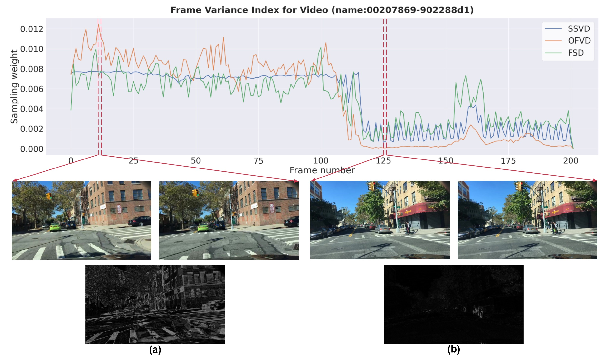
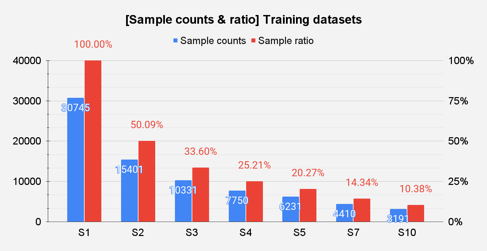
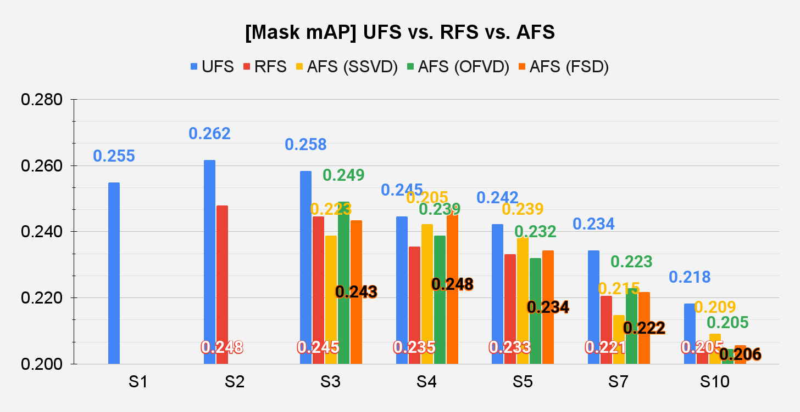
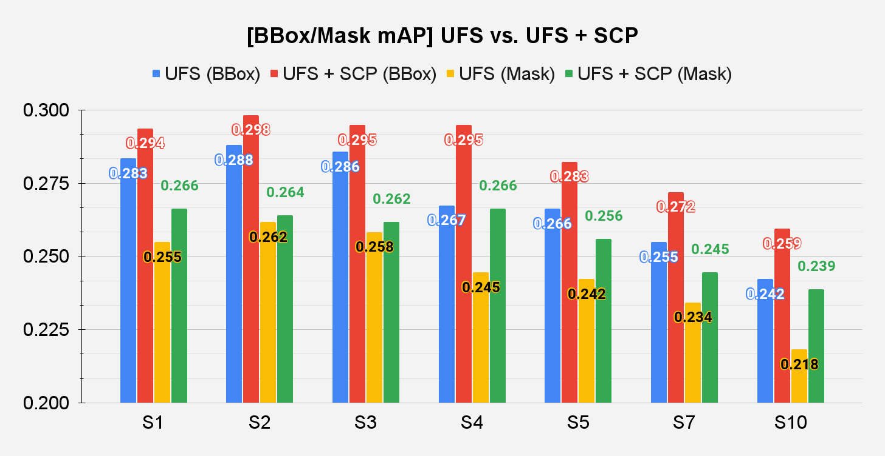

# EVFR (Exploring Video Frame Redundancy)

A Python library designed to reduce spatiotemporal redundancy in video frames by leveraging embedding extraction and sampling techniques. The library supports diverse embeddings (e.g., Represntation models, optical flow, SSIM, etc.) and sampling algorithms (e.g., Farthest Point Sampling, Submodular Optimization, etc.) with **various distance metrics** (Euclidean, Cosine, Manhattan, Minkowski, etc.) for maximum flexibility.

This library is part of the work presented in the paper:

> **"Exploring Video Frame Redundancies for Efficient Data Sampling and Annotation in Instance Segmentation"**\
> Published at the **CVPR 2023** workshop, *Vision Dataset Understanding*.

## Introduction

Recent advances in **deep learning** have significantly advanced video-related tasks such as **instance segmentation**, **action recognition**, and **video-language modeling**. Despite the growing need for large-scale training datasets, traditional research has largely overlooked the issue of **frame redundancy** in consecutive frames.

Excessive frame redundancy can:
- Increase annotation costs
- Slow down training
- Potentially degrade model generalization due to **overfitting**

Not all frames in a video contribute equally—many frames share high similarity with their neighboring frames, making them less valuable for performance improvement.

Our research, **"Exploring Video Frame Redundancies for Efficient Data Sampling and Annotation in Instance Segmentation,"** highlights the significance of strategically selecting **keyframes** to address these challenges. Specifically, we demonstrate:

- Identifying frames with meaningful visual or semantic differences rather than using all frames indiscriminately can maintain or even surpass the accuracy of state-of-the-art instance segmentation models.
- Significant reductions in training samples can be achieved without sacrificing performance.

Although this research focuses primarily on instance segmentation, the concept of minimizing redundancy is broadly applicable to various video tasks, including **action recognition** and **video-language modeling**.&#x20;


### Analysis of Frame Redundancy and Adaptive Sampling in the BDD100K Dataset
#### Frame Variance Index (FVI)

Figure 1: Frame Variance Index (FVI)|
:-------------------------:|
|

Figure 1 demonstrates the concept of frame redundancy using an example video (name:00207869-902288d1) from the [BDD100K dataset](https://bair.berkeley.edu/blog/2018/05/30/bdd/). The upper graph in Figure 1 depicts three distinct Frame Variance Indices (FVIs):

- **SSVD**: Structural Similarity Index Measure-based FVI
- **OFVD**: Optical Flow-based FVI
- **FSD**: Cosine Similarity-based FVI using ImageNet pre-trained ResNet50 features

These indices serve as adaptive sampling weights, highlighting frames with significant visual or semantic differences from subsequent frames. Subfigures (a) and (b) illustrate grayscale frame differences, clearly differentiating high variance (a) from low variance (b) scenarios based on the corresponding FVI values.

#### Reduced Dataset Definition

Figure 2: Reduced BDD100K Dataset Definition|
:-------------------------:|
|

For systematic experimentation, datasets with varying frame sampling ratios (denoted as S1–S10) are defined. A video is represented as an ordered set of frames:

$$
V = \{ f_1, f_2, \dots, f_T \}
$$

Regular frame sampling at stride $ s $ results in subsets defined as:

$$
V[\,\!:\!s] = \{ f_1, f_{1 + s \times k}, \dots \}, \quad k \in \{1,\dots,n\},\, 1 + s \times n < T
$$

These subsets (S2–S10) represent progressively reduced datasets, where, for example, **S2** retains approximately 50% of the original frames. Three sampling methodologies are explored:

- **Uniform Frame Sampling (UFS)**: Frames selected at consistent intervals.
- **Random Frame Sampling (RFS)**: Frames selected randomly.
- **Adaptive Frame Sampling (AFS)**: Frames selected based on variance weights calculated from the FVI metrics.

#### Performance Evaluation on Reduced Datasets

Figure 3: Performance Evaluation on Reduced Datasets (Mask mAP)|
:-------------------------:|
|

**Figure 3** compares Mask mAP across different reduced datasets (S2–S10). Notably, training models on strategically reduced datasets can result in comparable or even superior accuracy compared to the full dataset (S1). This suggests that eliminating redundant frames helps mitigate overfitting and enhances model generalization.

Figure 4: Performance Evaluation with Simple Copy-Paste (BBox/Mask mAP)|
:-------------------------:|
|

**Figure 4** further illustrates the benefits of dataset reduction by incorporating Simple Copy-Paste (SCP) augmentation. Both Bounding Box (BBox) and Mask mAP evaluations indicate that SCP augmentation effectively boosts model performance despite the reduced frame count. This augmentation introduces additional variability, compensating for fewer training frames and reinforcing the advantages of adaptive sampling.

### Contributions
The contributions of our work are summarized as follows:

- We demonstrate the potential of reducing the training dataset and its generation cost by using video keyframes, validated through extensive experiments showing maintained or improved model performance despite dataset size reductions.
- We show that higher frame rates do not always result in higher mean average precision (mAP) in instance segmentation tasks, particularly when frames contain high redundancy and minimal semantic variation.
- We demonstrate that the performances of each sampling method vary across the size of the sampled dataset; for instance, Adaptive Frame Sampling generally shows higher effectiveness in mask prediction due to its variance-based selection, whereas Uniform Frame Sampling often performs better in bounding box prediction due to consistent temporal spacing.
- We show that a simple copy-paste augmentation on the keyframes can bridge the large mAP gap caused by reducing frames.
- Lastly, we offer practical solutions for developing effective sampling methods and efficient data annotation strategies for instance segmentation models.

## EVFR Library Key Features

- **Multiple Embedding Models**: Easily extend the library with your own embedding approach (e.g, diverse representation models, optical flow, SSIM, etc).
- **Various Distance Metrics**: Euclidean, Cosine, Manhattan, Minkowski (and more can be added).
- **Sampling Algorithms**:
  - Farthest Point Sampling
  - Submodular-based Sampling (roadmap)
- **Modular Structure**: Well-organized code, easy to maintain 
and extend.
- **Efficient Computation**: Accelerated sampling and search operations leveraging [FAISS](https://github.com/facebookresearch/faiss) for fast similarity search and PyTorch Distributed Data Parallel (DDP) for scalable, distributed embedding computation.


## Getting Started

### Installation

1. Clone this repository:

   ```bash
   git clone https://github.com/jihun-yoon/EVFR.git
   cd EVFR
   ```

2. Install with pip (editable mode) or via setup.py:

    ```bash
    pip install -e .
    ```
    or
    ```bash
    python setup.py install
    ```

### Basic Usage

#### 1. Extracting Embeddings

EVFR provides two scripts for embedding extraction: single-process and distributed (DDP).

**Single GPU/CPU Inference:**
```bash
python scripts/embeddings_single_inference.py \
    --input_dir /path/to/images \
    --output_dir /path/to/save/embeddings \
    --batch_size 8 \
    --device cuda  # or 'cpu'
```

**Multi-GPU Distributed Inference:**
```bash
torchrun --nproc_per_node=2 scripts/embeddings_ddp_inference.py \
    --world_size 2 \
    --data_dir /path/to/images \
    --output_dir /path/to/save/embeddings \
    --batch_size 4 \
    --use_processor \
    --use_pooler
```

#### 2. Farthest Point Sampling

After extracting embeddings, use FPS to select diverse frames:

```python
from evfr.sampling.fps_faiss import FarthestPointSampler

# CPU sampling with L2 distance
sampler = FarthestPointSampler(metric="L2", device="cpu")
selected = sampler.sample(points=embeddings, k=10)

# GPU sampling with cosine similarity
sampler = FarthestPointSampler(metric="cosine", device="gpu")
selected = sampler.sample(paths=npz_files, k=10)
```

For more examples, see `scripts/fps_with_faiss.py`.

#### Complete Pipeline Example

1. Extract embeddings from your video frames
2. Apply FPS to select keyframes
3. Use selected frames for your downstream task

```python
from evfr.embeddings.hf_dinov2 import HuggingFaceDinoV2Embedding
from evfr.sampling.fps_faiss import FarthestPointSampler
from evfr.datasets.image_folder import ImageFolderDataset

# 1. Extract embeddings
model = HuggingFaceDinoV2Embedding(device="cuda")
dataset = ImageFolderDataset(root_dir="path/to/frames")
embeddings = model.extract_dataset(dataset, batch_size=8)

# 2. Sample diverse frames
sampler = FarthestPointSampler(metric="cosine", device="gpu")
selected_indices = sampler.sample(points=embeddings, k=10)

# 3. Get selected frame paths
selected_frames = [dataset.image_paths[i] for i in selected_indices]
```

For more detailed examples and advanced usage, please refer to the scripts in the `scripts/` directory.


## Citing This Work
If you use EVFR or the concepts presented in our CVPR 2023 workshop paper, please cite the following:

```bibtex
@InProceedings{Yoon_2023_CVPR,
    author    = {Yoon, Jihun and Choi, Min-Kook},
    title     = {Exploring Video Frame Redundancies for Efficient Data Sampling and Annotation in Instance Segmentation},
    booktitle = {Proceedings of the IEEE/CVF Conference on Computer Vision and Pattern Recognition (CVPR) Workshops},
    month     = {June},
    year      = {2023},
    pages     = {3308-3317}
}
```

**Or reference the GitHub repository:**

```latex
@misc{EVFRGitHub2023,
  author       = {Jihun Yoon},
  title        = {EVFR (Exploring Video Frame Redundancy) Library},
  publisher = {GitHub},
  journal = {GitHub repository},
  howpublished = {https://github.com/jihun-yoon/EVFR},
  year         = {2023}
}
```

## License
This project is licensed under the MIT License. You are free to use, modify, and distribute this software as permitted by the license.
